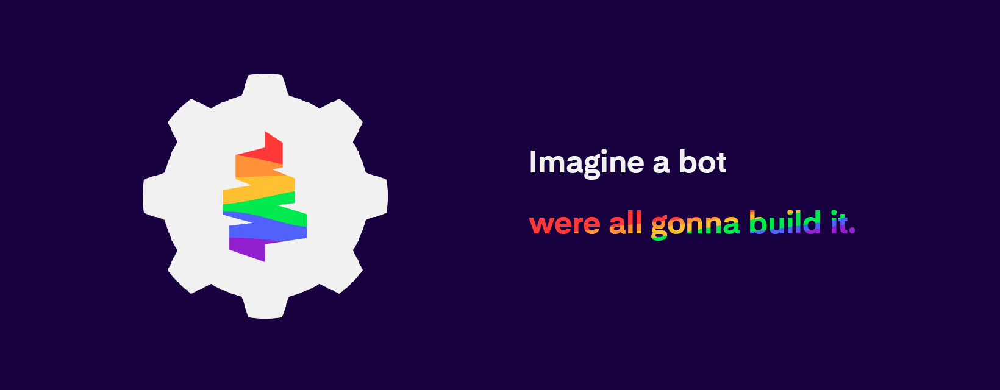

  

 

| **❗️ Important**: This project was an initiative of its own to contribute to the community, therefore, it has no direct connection with the [web3dev](https://www.web3dev.com.br/). |
| :-------------------------------------------------------------------------------------------------------------------------------------------------------------------------------------: |

 

<table>
  <tr>
    <td align="center">
      <a href="https://github.com/dev-jhon-yo">
        
         
        
          <b>dev.jhon.yo#0560</b>
        
      </a>
       
      <a href="#" title="Code">💻</a>
      <a href="#" title="Project Management">📆</a>
      <a href="#" title="Ideas, Planning, & Feedback">🤔</a>
    </td>
    <td align="center">
      <a href="https://github.com/pabloalbrnz">
        
         
        
          <b>pulse#7412</b>
        
      </a>
       
      <a href="#" title="Design">🎨</a>
      <a href="#" title="Code">💻</a>
      <a href="#" title="Project Management">📆</a>
      <a href="#" title="Ideas, Planning, & Feedback">🤔</a>
      </td>
</table>
 
<h1>Quick links</h1>
 

<table>
<thead>
  <tr>
    <th><h3>Overview</h3></th>
    <th><h3>User manual</h3></th>
    <th><h3>Use cases</h3></th>
  </tr>
</thead>
<!-- [Features]: Lista das features do bot, preview destas features -->
<!-- [Initial Settings]: Fundamentos que vao desde como adicionar o bot corretamente ao servidor como configurar/utilizar os sistemas  -->
<!-- [For Developers]: Todos os passos para clonar repositório e configurações inicias para iniciar o bot localmente -->
<tbody>
  <tr>
    <td><a href="#-">✨ Features</a></td>
    <td><a href="#-">🛠️ Initial Settings</a></td>
    <td><a href="#-">🖥️ For developers</a></td>
  </tr>
</table>
 
<h1>Conduct code</h1>

  - Don't be a jerk, have common sense.
   
  - Do not use our project in a way that could ignite, disturb or cause any kind of inconvenience to others.

